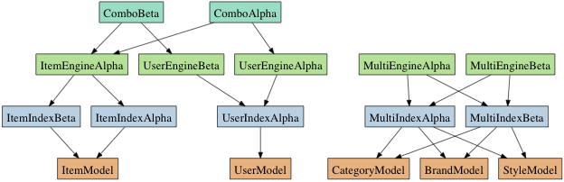

Elasticsearch is a tricky integration point for many Rails apps. When we added search to [Pose](http://pose.com) we went through a months long process of refinement, trying out different solutions and ultimately rejecting them and building our own as shortcomings became apparent and complexity rose. In the end we wound up building our own client, [Stretcher](https://github.com/PoseBiz/stretcher), and our own set of Rails integration tools which are not yet open-sourced, but are described in this document.

## Our Pipeline

Our first major concern was implementing a pipeline for converting our model objects to elastic search documents. We wound up implementing an indexing strategy that boils down to:

1. Model is saved / created / deleted
1. An entry is added to our index_requests queue
1. A cron job goes through the queue and re-indexes the items in it.

For initial imports of tables this would obviously not work as we'd need to create a queue entry of multi-million row tables. For that we have a bulk_worker job that will index every record in a table, going through the table in chunks.

Both the index_requests queue worker and the bulk worker are implemented as DelayedJob jobs capable of running in a parallel, sharded fashion.

## Why We Don't Index in Realtime

Luckily realtime indexing was not a business requirement for us. While triial to implement realtime indexing brings a lot of fragility and potential for failure. The *easiest* way to use ElasticSearch is to simply add an indexing PUT request to ElasticSearch straight into model hooks, we eschewed that for several reasons:

* Indexing bound to the HTTP request response cycle impacts response times to users.
* Indexing can be slow and expensive. Some of our objects require serializing multiple associated models each time indexed.
* Frequently updated models would wind up being indexed multiple times per second. On Pose a 'love' action, which can have high velocity, requires a re-indexing. By using a queue we can ensure it only gets re-indexed once per 10 minutes at most.
* Breaking indexing out to a background task gives us better a better failure mode given a downed search server.
* Bursts of traffic are smoothed through the queue.
* Periodic indexing lets us use ElasticSearch's more efficient [bulk indexing api](http://www.elasticsearch.org/guide/reference/api/bulk.html).
* Results are cached by our Rails app in memcached anyway to keep load on ElasticSearch low, negating the value of realtime.

## Multiple Indexes Per Model and Multiple Models Per Index

One of our main criteria in building out our architecture was supporting multiple indexes per model. This was important because:

* ElasticSearch indexes are *not* 1:1 mappings of your Rails models, they may have different tokenization, boosts, and even entirely different fields.
* Multiple indexes ease operational concerns, letting you deploy a new index in parallel to an existing one, letting us populate it before switching to it.
* When it comes to experimental features we've found supporting multiple indexes per model to be quite useful. We can run a sandboxed experiment and watch it react to live data in isolation.

We also wanted to make sure that we could cleanly map an index to multiple models. ElasticSearch supports multiple document types co-existing within a single index, something we exploit for our upcoming autocomplete feature. Each Index class in our class structure has a list of "indexable_classes" that it can index.

## Our Class Structure

ElasticSearch and an SQL server have very little in common, following this our supporting class structure for ElasticSearch looks very little like ActiveRecord. The classes we went with are as follows:

* **Index:** Maps to an ElasticSearch index
* **Engine:** Maps to an ElasticSearch query
* **Combo:** Maps to an combination of queries / indexes using the [multi search api](http://www.elasticsearch.org/guide/reference/api/multi-search.html)

A diagram of this structure showing some of the possible combinations of these classes is shown below:

One of the attributes of this architecture that may seem strange and un-ruby/rails like is using a full class for a query. ActiveRecord, for instace, uses class and instance methods on a model for queries/scopes. Our rationale here was that elasticsearch queries can be *very* complex, and have a large amount of supporting code to generate these queries. Encapsulating them as methods would have lead to bloated, confusing classes.

It should be noted the index classes implement a 'client' method that is an instance of Stretcher::Index, through which all actual elastic search operations are performed.

Additionally, there is a not pictured IndexRegistry class that specifies which indexes are active, and provides methods to quickly determine which indexes apply to a particular model, and allows iteration through all active indices.

## Why We Wrote Our Own ElasticSearch Client

There were a number of available ElasticSearch clients when we started our project. We tried some of the more popular options, but after a couple months it was apparent they were not up to the task for the following reasons:

* **Bad APIs:** The clients we vetted mapped to ElasticSearch in inconsistent or confusing ways. ElasticSearch's API is complex and does not have very complete docs, a bad API means reconciling already unclear docs through an unnecssary abstraction layer.
* **Inefficient Rails integration:** we wound up writing our own high performance classes for importing data (described later in this doc)
* **Poor support for multiple indexes per Rails model:** This was important for us, our Index classes hook into models, not the other way around.
* **Incomplete APIs:** Stretcher does *not* attempt to describe the ElasticSearch API with complex objects, but is mostly a DSL for building URLs and request bodies, then returning JSON as hashes. This let us implement our client quickly.
* **Inefficient connection handling:** Stretcher uses Net::HTTP::Persistent to efficiently re-use a single keep-alive connection in a thread-safe manner.

## Efficency Concerns

### Efficiently Queueing Index Requests

Special care was taken to write SQL queries that would allow for efficient indexing of ElasticSearch data. Firstly, the queue for index requests is implemented as a table 'index_requests' in our Postgres database. Using a database table for this queue is fast enough and has the added bonus of being transactional. 

Inserts to this table first check for a previous IndexRequest row for the specific object being indexed. This query would optimally be an 'upsert', but since such operations in Rails are a bit tricky without writing complex bare SQL we opted to simply perform a 'SELECT' for duplicate records before writing to the queue. While this is a race, the worst case outcome of this is indexing items with a high change rate once or twice more, a tolerable tradeoff.

### Efficiently Reading Off The Queue

The query to read off the queue simply grabs items in an un-ordered fashion using a modulus operation for sharding between workers. In Postgres this is an efficient query, though it has the downside of not processing the queue in any particular order. For us, this is an acceptable tradeoff.

### Efficiently Indexing a Large Un-indexed Model

Indexing a whole table that has never before been indexed is a bit different. Since most of our datasets are not sparse, we used fast chunking queries. Paging with libraries like kaminari or will_paginate gets slow with high page numbers (around page 100,000 for instance) as the server has to get a total order for the table. Instead of using paging libraries the sharded workers find the max id at the start of indexing, and go through it in integer ranges, with queries like 'id >= 100 AND id <= 199'. These workers are sharded, using a modulo for page ranges.

## Only the Start

We haven't been using ElasticSearch for very long, perhaps only 6 months. Hopefully this information will be useful for others in the Rails world! I'll be following up with new lessons we've learned in the future!